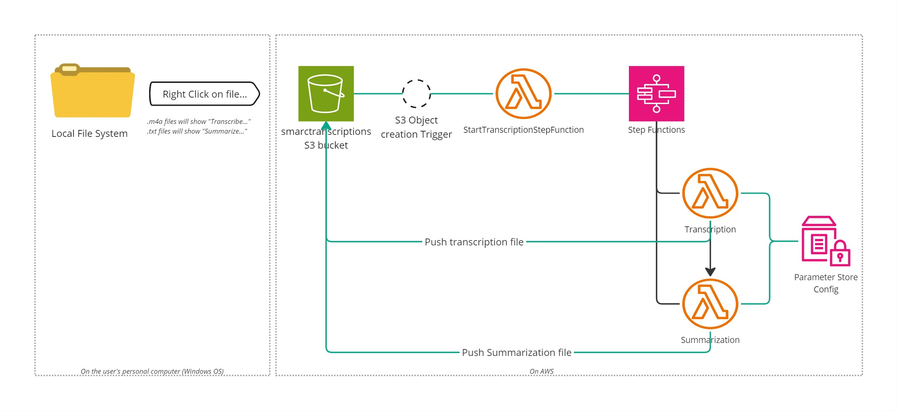

This project is an addon to Windows to transcribe and summarize audio files.  
For the fun of it (and to learn about AWS Lambda and AWS Step Functions) here is how it works:


# Transcription lambda function
## Packaging
Create a package/transcription directory under the project root.  
In the package directory:  
Install the dependencies (look at the source code to find them)  
!Important!: To install the dependencies in the package directory, use --target .   
The dependencies are:  
```
pip install --target . boto3  
pip install --target . assemblyai  
```

To create the zip package itself:  
go to the build directory and run build_lambda.sh  
This should create the transcriptions.zip package (in the main directory)  

# Summarization lambda_transcription function
## Packaging
Create a package/summarization directory under the project root.
In the package directory: 
Install the dependencies (look at the source code to find them)  
!Important!: To install the dependencies in the package directory, use --target .   
The dependencies are:  
```
pip install --target . boto3  
pip install --target . assemblyai  
```

To create the zip package itself:  
go to the build directory and run build_lambda.sh  
This should create the transcriptions.zip package (in the main directory)  

# Appendix
## The watcher service 
The watcher service is a windows service written in python.  
It monitors a local file system and push new files created in the file system to an S3 bucket.  
It is no longer used in the latest implementation, but it was fun to create, so i am leaving it here.  

## How to build the watcher windows service
You first need to clone the git repo in windows  
You need to build it as administrator (to be able to install or uninstall the serrice)  

## Create the windows service executable
First create the Windows executable  
`pyinstaller --hiddenimport win32timezone -F watcher.py`

## Install the service
`dist\watcher.exe install`

## Start the service
`dist\watcher.exe start`

## Stop the service
`dist\watcher.exe stop`

## Remove the service
If you need to remove the sevice:  
`dist\watcher.exe remove`

