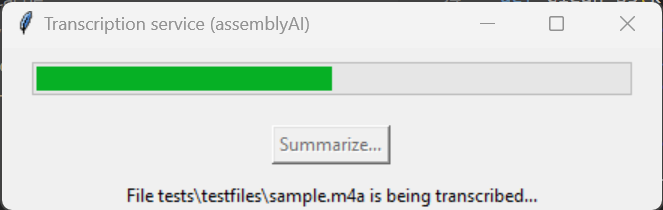

This project is an addon to Windows to transcribe and summarize audio files.  

It provides 2 ways of using transcription and summarization services.  
+ The first is native windows implementation where we are extending the right click menu on audio file extensions to register a UI doing the transcription and summarization.  
+ The second is an AWS implementation through the usage of an S3 bucket.

# Windows native implementation
It is a user interface:  
  
The user interface is simplistic. It has to be lauched with the `--file <filename>` argument.  
It will then  transcribe the file with automatic language detection.
Once done and if successfull, it will enable the Summrize button to offer the ability to summarize the file.  
  
For the curious:
* The transcription is done with the assemblyai API
* The summarization is done with the OPEN AI API

## Building the extension binary:
In your favorite script directory:  
copy config.py, summarize.py, transcribe.ps1, transcribe.py and transcriptionUX.py  
We then need to create an exe:  
Run the powershell command `Install-Module -Name ps2exe`  
This will install a module creating an exe from a powershell script  
The run `ps2exe transcribe.ps1 transcribe.exe -noConsole`.  
This will create the executable

## Installing the windows explorer extension:
* Open the Windows Registry Editor by typing regedit in the Start menu and pressing Enter.  
* Find the file extension you want to configure (e.g., .txt) and expand it. You might find it under a key like .m4a.
* Note the Content Type or OpenWithList subkey, then navigate to HKEY_CLASSES_ROOT\SystemFileAssociations\m4a. Typically this is Navigate to Computer\HKEY_CLASSES_ROOT\SystemFileAssociations\.m4a\
* You can add a new string key under this location for your specific application. For example, create a key named shell
* Create key under shell with your desired action name (like Transcribe...).
* Create a new key under the action called command  
It should look like this:  
  
* In the string value of command point to transcribe.exe installed somewhere in your operating system

# AWS Implementation 
Here is how it works:

## Transcription lambda function
### Packaging
Go to the build directory and run build_lambda.sh  
This should create the transcriptions.zip in package/transcription (from the main directory)  

## Summarization lambda function
### Packaging
Go to the build directory and run build_lambda.sh  
This should create the summarizations.zip package/summarization (from the main directory)  

### The watcher service 
The watcher service is a windows service written in python.  
It monitors a local file system and push new files created in the file system to an S3 bucket.  
It is no longer used in the latest implementation, but it was fun to create, so i am leaving it here.  

#### How to build the watcher windows service
You first need to clone the git repo in windows  
You need to build it as administrator (to be able to install or uninstall the serrice)  

#### Create the windows service executable
First create the Windows executable  
`pyinstaller --hiddenimport win32timezone -F watcher.py`

#### Install the service
`dist\watcher.exe install`

#### Start the service
`dist\watcher.exe start`

#### Stop the service
`dist\watcher.exe stop`

#### Remove the service
If you need to remove the sevice:  
`dist\watcher.exe remove`

